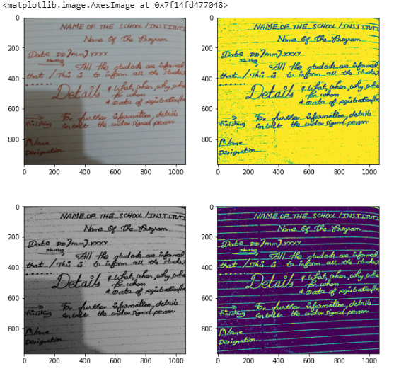

# line_removal
A text notebook page line removal 
#### This code can remove lines in a textbook page and can be useful to detect text paragraph in any handwritten page

# Usage:
#### First clone the repository and run<code> predict.py </code>script 
###### Choose any one method and comment other one
``` python
# Run code 

# run any one method
# method-1  
image = remove_line(r"path/of/img.jpg") 

# method-2
#img = cv2.imread(r"path/to/image.jpg", cv2.IMREAD_COLOR)
#image = remove_line(img)
```
## Test output 



